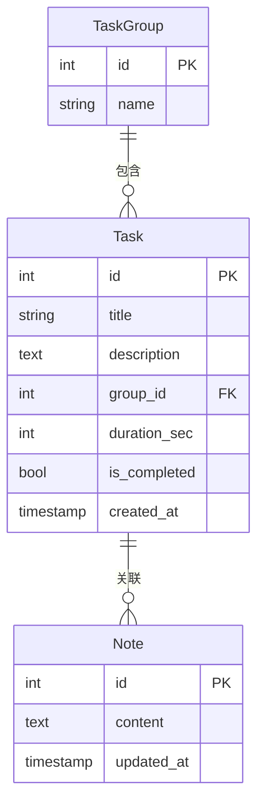
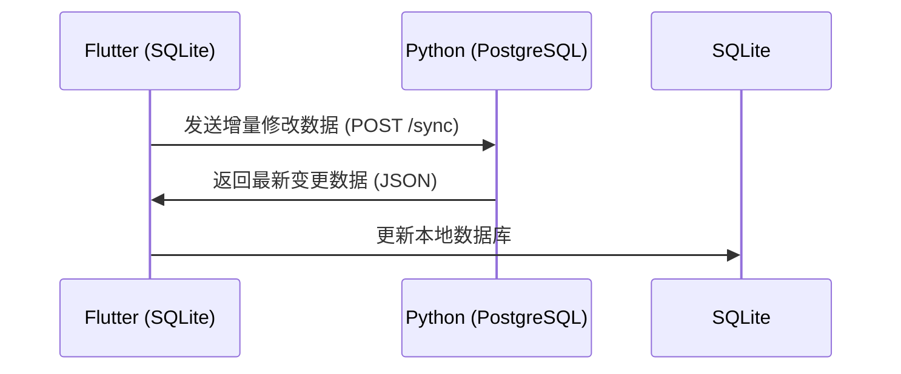
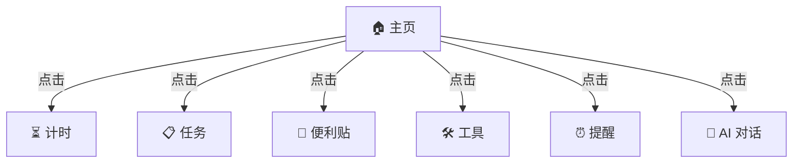

设想由AI生成，基本描述了我的设计思路。

----
# Potato Task 技术架构设想

## 1. 概述
Potato Task 设想为一款跨平台（Android、Windows、Linux）的任务管理与计时应用，希望能够结合正向计时、倒计时、任务管理、Markdown 便利贴、随机工具、设备使用时长提醒、睡眠提醒及 LLM 对话功能。初步计划使用 Flutter + SQLite 作为客户端存储，Python + PostgreSQL 作为服务端，支持本地存储与远程同步。

## 2. 技术架构设想
### 2.1 总体架构
当前的想法是采用 Clean Architecture 结合 Riverpod 进行状态管理，以期望获得较好的可维护性和可扩展性。

```mermaid
graph TD
    UI[UI 层 (Flutter)] -->|用户操作| Logic[业务逻辑层]
    Logic -->|数据请求| Repository[数据仓库层]
    Repository -->|本地存储| SQLite[SQLite 数据库]
    Repository -->|远程同步| API[远程 API (Python + PostgreSQL)]
```

## 3. 客户端设计设想
### 3.1 代码组织结构
```plaintext
lib/
├── features/            # 业务功能模块
│   ├── timer/           # 计时器功能
│   ├── tasks/           # 任务管理
│   ├── notes/           # Markdown 便利贴
│   ├── tools/           # 实用小工具
│   ├── reminders/       # 设备使用 & 睡眠提醒
│   ├── llm_chat/        # LLM 对话
│   ├── sync/            # 数据同步模块
│   └── home/            # 主页 & 导航
│
├── core/                # 核心层
│   ├── common/          # 公共组件
│   ├── utils/           # 工具类
│   ├── exceptions/      # 统一异常处理
│   ├── network/         # 网络请求封装
│   ├── db/              # SQLite 操作封装
│   ├── services/        # 设备相关服务（如通知、权限）
│
├── main.dart            # 启动文件
└── app.dart             # 应用入口，统一路由管理
```

希望该结构能保证代码的高内聚、低耦合，使得不同功能模块可以独立开发、测试和维护。

### 3.2 本地数据库 (SQLite)

本地数据库计划采用 SQLite 存储任务、任务组及 Markdown 便利贴，同时希望支持数据同步。

## 4. 服务端设计设想
### 4.1 目标
服务端的目标是实现数据同步，计划采用 Python + PostgreSQL 作为后端方案。当前考虑的实现方式是存储 JSON 数据，并仅进行增量更新。

### 4.2 数据同步策略
Potato Task 设想采用 **先本地存储，后远程同步** 机制，以保证离线可用性。



**同步策略设想：**
- **本地优先**：用户数据先写入 SQLite，保证即时响应。
- **后台同步**：定期同步到服务器，减少同步对用户体验的影响。
- **增量更新**：客户端仅上传修改的任务（新增、删除、更新），避免传输整个 JSON 数据。
- **冲突处理**：服务端可能会基于时间戳或版本号管理数据，优先考虑最新的修改。

### 4.3 数据存储方案
PostgreSQL 计划用于存储任务数据，数据存储格式初步设想如下：
```json
{
    "user_id": "12345",
    "tasks": [
        {"id": 1, "title": "任务 A", "status": "completed"},
        {"id": 2, "title": "任务 B", "status": "pending"}
    ],
    "last_sync": "2025-02-08T12:00:00Z"
}
```

## 5. UI 设计设想
应用 UI 计划采用 **BottomNavigationBar + Drawer 结合** 进行导航。



## 6. 未来方向
- **优化同步策略**：需要进一步验证增量同步的可行性。
- **探索更好的存储方案**：当前设想采用 JSON 存储，是否适用于 PostgreSQL 仍待实验。
- **改进 UI/UX**：优化交互体验，使任务管理更加便捷。

此文档仅为 Potato Task 目前的架构设想，具体实现方案仍待进一步探索和验证。


